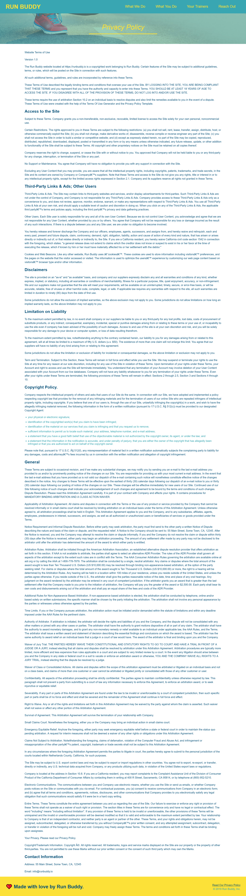

# run-buddy2.0

## Description
- Run Buddy is a website where people with fitness goals can go to connect with personal trainers.
- A website resembling a lead generation to increase revenue and help individuals attain their fitness goals.
- I utilized the following languages and technologies: HTML, CSS & Git.
- Enhanced CSS from previous version https://emalie.github.io/run-buddy/

## Installation
- Installation not required.

## Usage
- Static webpage with a linked privacy policy that can be viewed via the hyperlink in the footer. 

```md


```

## Link to the deployed application on GitHub
https://emalie.github.io/run-buddy2.0/

## Credits
- No collaborators. 

## License
MIT License

Copyright (c) [2023] [Emily Andrews]

Permission is hereby granted, free of charge, to any person obtaining a copy
of this software and associated documentation files (the "Software"), to deal
in the Software without restriction, including without limitation the rights
to use, copy, modify, merge, publish, distribute, sublicense, and/or sell
copies of the Software, and to permit persons to whom the Software is
furnished to do so, subject to the following conditions:

The above copyright notice and this permission notice shall be included in all
copies or substantial portions of the Software.

THE SOFTWARE IS PROVIDED "AS IS", WITHOUT WARRANTY OF ANY KIND, EXPRESS OR
IMPLIED, INCLUDING BUT NOT LIMITED TO THE WARRANTIES OF MERCHANTABILITY,
FITNESS FOR A PARTICULAR PURPOSE AND NONINFRINGEMENT. IN NO EVENT SHALL THE
AUTHORS OR COPYRIGHT HOLDERS BE LIABLE FOR ANY CLAIM, DAMAGES OR OTHER
LIABILITY, WHETHER IN AN ACTION OF CONTRACT, TORT OR OTHERWISE, ARISING FROM,
OUT OF OR IN CONNECTION WITH THE SOFTWARE OR THE USE OR OTHER DEALINGS IN THE
SOFTWARE.
